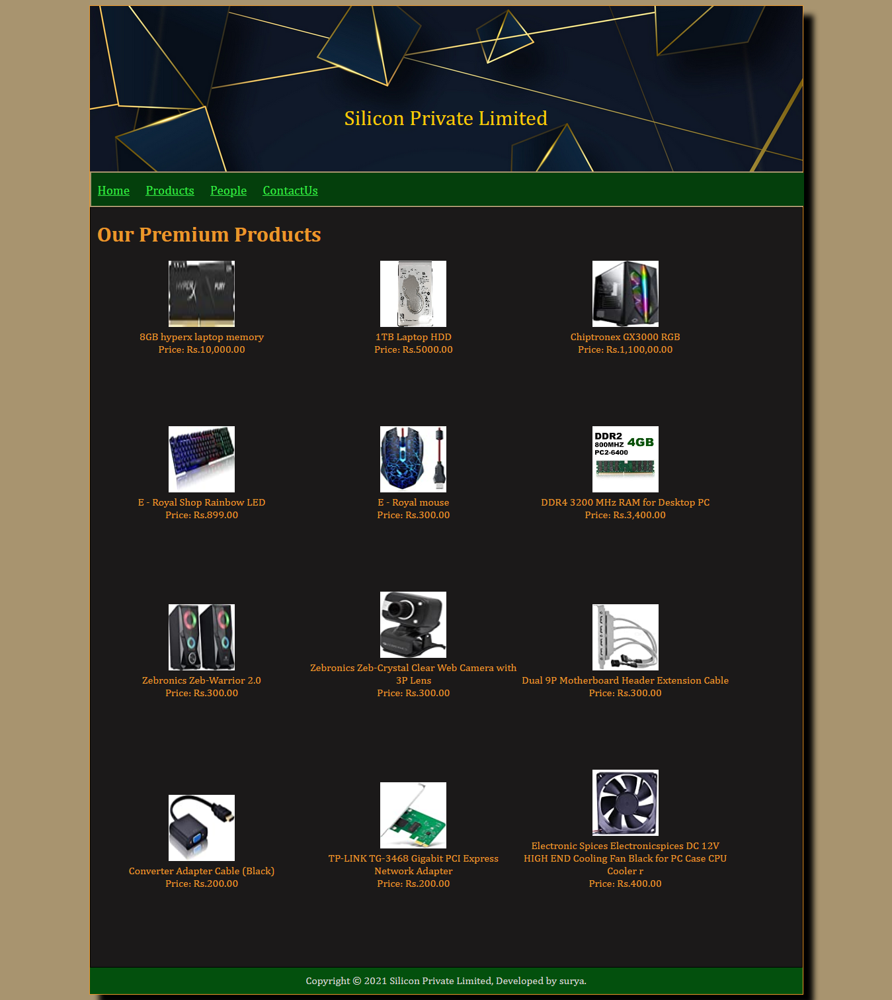
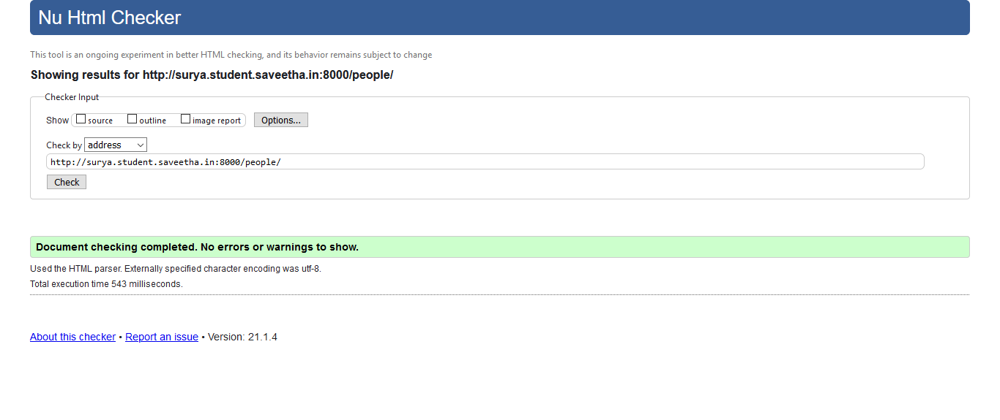
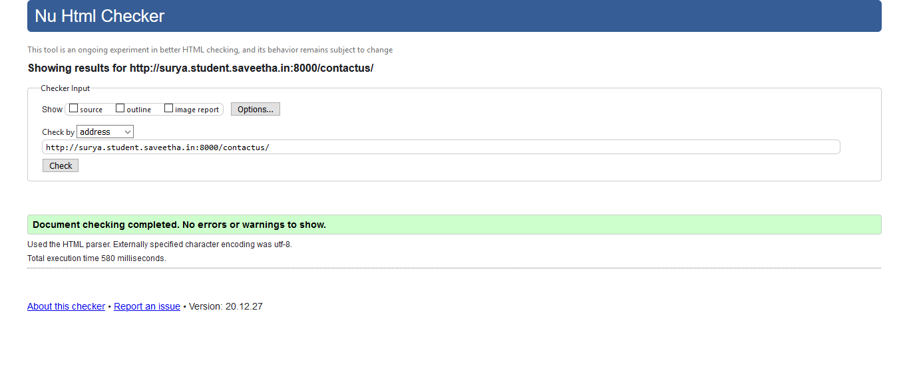

# Web Design for a Manufacturing Company
## AIM: 
To design a static website for a chip manufacturing company.

## DESIGN STEPS:
### Step 1: 
Requirement collection.
### Step 2:
Creating the layout using HTML and CSS.
### Step 3:
Updating the sample content.
### Step 4:
Choose the appropriate style and color scheme.
### Step 5:
Validate the layout in various browsers.
### Step 6:
Validate the HTML code.
### Step 6:
Publish the website in the given URL.

## PROGRAM:

### base.html
```

<!DOCTYPE html>
<html lang="en">

<head>
    <title>Silicon Private Limited</title>
    <link rel="stylesheet" href="">
    <link rel="icon" href="" type="image/x-icon">

</head>

<body>
    <div class="container">
        <div class="banner">
            Silicon Private Limited
        </div>
        <div class="menu">
            <div class="menuitem"><a href="/home">Home</a></div>
            <div class="menuitem"><a href="/products">Products</a></div>
            <div class="menuitem"><a href="/people">People</a></div>
            <div class="menuitem"><a href="/contactus">ContactUs</a></div>
        </div>
        <div class="content">
            
            
        </div>
        <div class="footer">
            Copyright © 2021 Silicon Private Limited, Developed by surya.
        </div>
    </div>
</body>

</html>
```

### home.html
```



    <div class="homecontent">    
    <h1>About Us</h1>
    
    <div class="contenttext">
    Silicon Pvt Ltd, provides a broad range of semiconductor and infrastructure software applications that serve the data center, networking, software, broadband, wireless, and storage and industrial markets. Common applications for its products include: data center networking, home connectivity, broadband access, telecommunications equipment, smartphones, base stations, data center servers and storage, factory automation, power generation and alternative energy systems, displays, and mainframe operations and management, and application software development. Some of Silicon's core technologies and products include:
    <ul>
        <li> Memory Chips </li>
        <li> SATA HDD </li>
        <li> SATA SSD </li>
        <li> Broadband Modems </li>
        <li> Wifi Devices </li>
        <li> Switching Devices </li>
        <li> Optical Sensors </li>
    </ul> 
    </div>
    </div>

```

### products.html
```



    <div class="productcontent">
        <h1>Our Premium Products</h1>
        <div class="productitems">
            <div class="productitem">
                <div class="itemimage">
                    
                </div>
                <div class="itemname">8GB hyperx laptop memory</div>
                <div class="itemprice">Price: Rs.10,000.00 </div>
            </div>
            <div class="productitem">
                <div class="itemimage">
                    
                </div>
                <div class="itemname">1TB Laptop HDD</div>
                <div class="itemprice">Price: Rs.5000.00 </div>
            </div>
            <div class="productitem">
                <div class="itemimage">
                    
                </div>
                <div class="itemname">Chiptronex GX3000 RGB </div>
                <div class="itemprice">Price: Rs.1,100,00.00 </div>
            </div>
            <div class="productitem">
                <div class="itemimage">
                    
                </div>
                <div class="itemname"> E - Royal Shop Rainbow LED</div>
                <div class="itemprice">Price: Rs.899.00 </div>
            </div>
            <div class="productitem">
                <div class="itemimage">
                    
                </div>
                <div class="itemname"> E - Royal mouse </div>
                <div class="itemprice">Price: Rs.300.00 </div>
            </div>
            <div class="productitem">
                <div class="itemimage">
                    
                </div>
                <div class="itemname"> DDR4 3200 MHz RAM for Desktop PC </div>
                <div class="itemprice">Price: Rs.3,400.00 </div>
            </div>
            <div class="productitem">
                <div class="itemimage">
                    
                </div>
                <div class="itemname"> Zebronics Zeb-Warrior 2.0 </div>
                <div class="itemprice">Price: Rs.300.00 </div>
            </div>
            <div class="productitem">
                <div class="itemimage">
                    
                </div>
                <div class="itemname">Zebronics Zeb-Crystal Clear Web Camera with 3P Lens </div>
                <div class="itemprice">Price: Rs.300.00 </div>
            </div>
            <div class="productitem">
                <div class="itemimage">
                    
                </div>
                <div class="itemname"> Dual 9P Motherboard Header Extension Cable </div>
                <div class="itemprice">Price: Rs.300.00 </div>
            </div>
            <div class="productitem">
                <div class="itemimage">
                    
                </div>
                <div class="itemname">Converter Adapter Cable (Black)</div>
                <div class="itemprice">Price: Rs.200.00 </div>
            </div>
            <div class="productitem">
                <div class="itemimage">
                    
                </div>
                <div class="itemname">TP-LINK TG-3468 Gigabit PCI Express Network Adapter</div>
                <div class="itemprice">Price: Rs.200.00 </div>
            </div>
            <div class="productitem">
                <div class="itemimage">
                    
                </div>
                <div class="itemname">Electronic Spices Electronicspices DC 12V HIGH END Cooling Fan Black for PC Case CPU
                    Cooler r</div>
                <div class="itemprice">Price: Rs.400.00 </div>
            </div>
        </div>    
    </div>
{% endblock  %
```

### people.html
```



    <h1>S</h1>
    <div>
    <h2><b>ROBERT_DOWNEY JR</b></h2>
    <div class="itemimage">
        
    </div>
    <P>Designation:<b>FOUNDER</b></P>
    </div>

    <div>
    <br>
    <h2><b>JACK_MA</b></h2>
    <div class="itemimage">
        
    </div>
    <P>Designation:<b>CEO</b></P>
    <br>
    </div>

    <div>
    <br>
    <h2><b>LARRY_ELLISON</b></h2>
    <div class="itemimage">
        
    </div>
    <P>Designation:<b>TECHNICAL HEAD</b></P>
    <br>
    </div>

    <div>
    <br>
    <h2><b>GAUTAM_ADANI</b></h2>
    <div class="itemimage">
        
    </div>
    <P>Designation:<b>R&D HEAD</b></P>
    <br>
    </div>

    <div>
    <br>
    <h2><b>CHRIS_HEMSWORTH</b></h2>
    <div class="itemimage">
        
    </div>
    <P>Designation:<b>DESIGN HEAD</b></P>
    <br>
    </div>

    <div>
    <br>
    <h2><b>GIGI_HADID</b></h2>
    <div class="itemimage">
        
    </div>
    <P>Designation:<b>MARKETTING HEAD</b></P>
    <br>
    </div>

```

### contactus.html
```



   

    <h1>
           CONTACT
    </h1>
    <hr>
    <h2>
           EMAIL ID:siliconprivatelimited@gmail.com<br>
            <br>
       CONTACT NO:9344857514
    </h2>
    <hr>
{% endblock  %
```

## OUTPUT:




## CODE VALIDATION REPORT:





## RESULT:
Thus a website is designed for the chip manufacturing company and is hosted in the URL http://surya.student.saveetha.in:8000/. HTML code is validated.